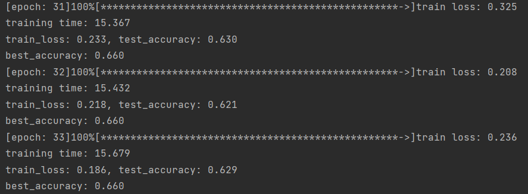

# Classify on database Caltech101 using AlexNet
## 2022.5.4 prepare the data
Split the data into train / valid / test  (split_dataset.py) and make csv for them(generate_csv.py)

Make a dataset class  (Caltech101_Dataset.py)

Try to use dataloader for training on mini-batch

## 2022.5.5 construct the network
Construct AlexNet  (AlexNet.py)

Train  (train.py)

Adjust some parameters.  

learning from the paper for AlexNet, but they have more data, so maybe we need to  <mark>train more in lower lr. </mark>
```
When batch-size=32 and lr=1e-5,the acc and loss stay still.

I'm confused about that,but finally I found:Be patient to the network!
```
## 2022.5.6 train and adjust parameters. 
train-3 : save the parameters of train-2, and load these parameters to train more epochs. <mark>stuck in a local optimum</mark>




|     | epoch              | batch-size | lr   | weight_decay | acc   |
|-----|--------------------|------------|------|--------------|-------|
| 1   | 100                | 128        | 1e-5 | 0            | 0.611 |
| 2   | 100                | 128        | 1e-3 | 0.0005       | 0.622 |
| 3   | 100(train-2) + 100 | 128        | 1e-3 | 0.0005       | 0.660 |
| 4   | 200                | 128        | 1e-4 | 0.0005       |       |
| 5   |                    |            |      |              |       |